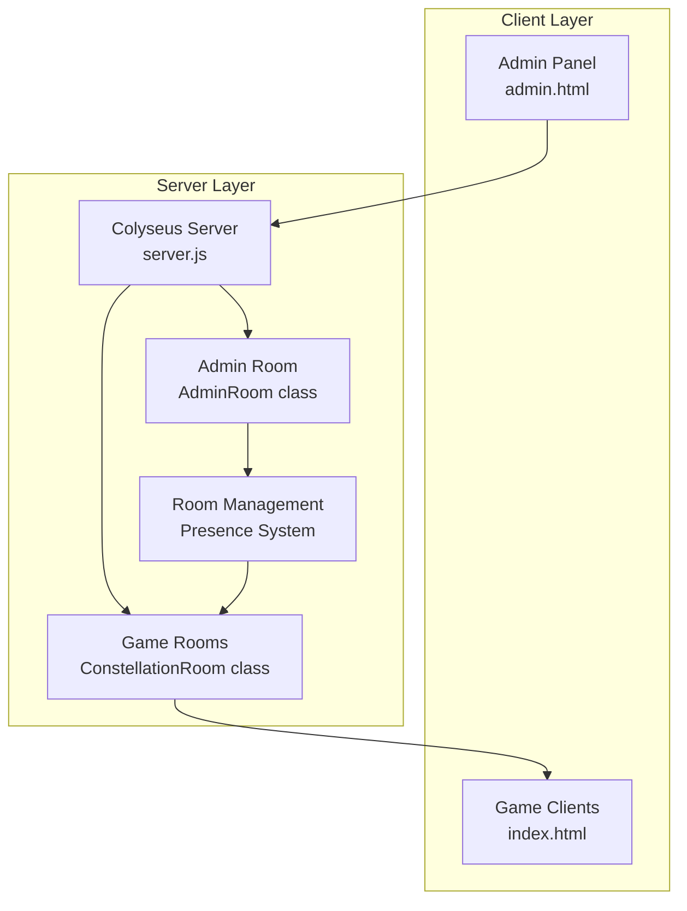

# Design Document

## Overview

The Colyseus Admin Integration system provides a robust, real-time multiplayer game management interface built on top of the existing Colyseus server infrastructure. The design enhances the current admin panel with improved connection management, comprehensive error handling, and streamlined testing capabilities for multiplayer game sessions.

The system consists of three main components: the Admin Panel (client-side interface), the Colyseus Server (game room management), and the Game Client (player interface). These components communicate through WebSocket connections managed by the Colyseus framework, providing real-time updates and seamless multiplayer functionality.

## Architecture

### System Components



### Communication Flow

1. **Admin Panel Connection**: Admin interface connects to AdminRoom for management operations
2. **Room Creation**: Admin sends room creation requests through AdminRoom to Colyseus presence system
3. **Player Connections**: Game clients connect directly to ConstellationRoom instances
4. **Real-time Updates**: All state changes propagate through WebSocket connections
5. **Cross-Room Communication**: AdminRoom monitors and controls ConstellationRoom instances

### Technology Stack

- **Frontend**: Vanilla JavaScript with Colyseus.js client library
- **Backend**: Node.js with Colyseus framework and Express.js
- **Real-time Communication**: WebSocket connections via Colyseus
- **State Management**: Colyseus Schema for synchronized state
- **Game Rendering**: PixiJS for game client visualization

## Components and Interfaces

### Admin Panel Interface (ColyseusAdminManager)

**Purpose**: Client-side manager for admin panel functionality

**Key Methods**:
- `initialize()`: Establishes connection to AdminRoom with retry logic
- `createGameRoom(config)`: Creates new game sessions with specified configuration
- `startGame(roomId)`: Initiates gameplay for pending sessions
- `deleteGame(roomId)`: Removes and cleans up game sessions
- `assignPlayerToTeam(roomId, playerId, teamIndex)`: Manages team assignments

**Connection Management**:
- Automatic reconnection with exponential backoff
- Connection status indicators
- Graceful error handling and user feedback
- Maximum retry limits to prevent infinite loops

### AdminRoom (Server-side)

**Purpose**: Central hub for game session management and admin operations

**Message Handlers**:
- `create_room`: Processes room creation requests with validation
- `start_game`: Triggers game start for specified rooms
- `delete_room`: Handles room deletion and cleanup
- `assign_team`: Manages player team assignments across rooms

**State Management**:
- Maintains registry of active game rooms
- Broadcasts room list updates to connected admins
- Handles cross-room communication via presence system
- Periodic room status synchronization

### ConstellationRoom (Game Room)

**Purpose**: Individual game session management and player coordination

**Core Features**:
- Player connection and disconnection handling
- Team assignment and balancing
- Game state transitions (waiting → playing → completed)
- Real-time player updates to AdminRoom
- AI bot integration and management

**Configuration Support**:
- Customizable game parameters (rounds, moves, timers)
- Map data injection (JSON format or random generation)
- Scoring multiplier configuration
- AI bot type and behavior settings

### Game Client Interface

**Purpose**: Player-facing game interface with multiplayer connectivity

**Integration Points**:
- Direct connection to ConstellationRoom instances
- Real-time game state synchronization
- Player input handling and validation
- Visual feedback for connection status

### Spectator Mode System

**Purpose**: Admin observation interface for live game monitoring and debugging

**Core Features**:
- Read-only connection to active game rooms
- Real-time cursor position tracking for all players
- Click event visualization with player identification
- Toggle controls for cursor and click visibility
- Player identification overlay with team colors

**Technical Implementation**:
- Separate spectator connection type to ConstellationRoom
- Mouse position broadcasting via WebSocket messages
- Click event capture and visualization system
- UI overlay for spectator controls and player identification

## Data Models

### Game Configuration Schema

```javascript
{
  name: String,           // Session display name
  type: String,           // Game type (Constellation, Geobridge, etc.)
  maxPlayers: Number,     // Maximum player capacity
  movesPerRound: Number,  // Moves allowed per round
  rounds: Number,         // Total number of rounds
  roundTime: Number,      // Duration of each round (seconds)
  countdownTime: Number,  // Pre-game countdown duration
  stealLimit: Number,     // Maximum steals per game
  hqMax: Number,          // Maximum headquarters per team
  multipliers: {          // Scoring configuration
    count: Number,
    distance: Number,
    hq: Number,
    destruction: Number
  },
  mapJson: String,        // Custom map data (optional)
  aiBots: Array           // AI bot configurations
}
```

### Room State Schema

```javascript
{
  roomId: String,         // Unique room identifier
  state: String,          // Current state (waiting, playing, completed)
  players: Map,           // Connected players with team assignments
  teams: Map,             // Team configurations and assignments
  config: Object,         // Game configuration parameters
  metadata: {             // Room metadata
    name: String,
    type: String,
    createdAt: String,
    gameState: String
  }
}
```

### Player State Schema

```javascript
{
  id: String,             // Unique player identifier
  name: String,           // Display name
  team: Number,           // Team assignment (null if unassigned)
  ready: Boolean,         // Ready status for game start
  connected: Boolean,     // Connection status
  isAI: Boolean,          // AI bot flag
  isSpectator: Boolean,   // Spectator mode flag
  cursor: {               // Real-time cursor position
    x: Number,
    y: Number,
    visible: Boolean
  },
  lastClick: {            // Last click event data
    x: Number,
    y: Number,
    timestamp: Number
  }
}
```

### Spectator Configuration Schema

```javascript
{
  showCursors: Boolean,     // Toggle cursor visibility
  showClicks: Boolean,      // Toggle click indicators
  playerColors: Map,        // Player identification colors
  spectatorId: String,      // Unique spectator identifier
  viewMode: String          // Spectator view mode (full, minimal, debug)
}
```

## Error Handling

### Connection Management

**Automatic Reconnection**:
- Exponential backoff strategy (2s, 4s, 8s, 16s, 32s)
- Maximum 5 reconnection attempts
- Clear user feedback during reconnection process
- Graceful degradation when connection fails

**Error Categories**:
1. **Network Errors**: Connection timeouts, WebSocket failures
2. **Server Errors**: Room creation failures, invalid operations
3. **Validation Errors**: Invalid configuration parameters
4. **State Errors**: Invalid game state transitions

### Error Recovery Strategies

**Room Creation Failures**:
- Detailed error messages with specific failure reasons
- Automatic retry for transient failures
- Configuration validation before submission
- Fallback to default settings for invalid parameters

**Game State Inconsistencies**:
- Periodic state synchronization
- Conflict resolution through server authority
- Player reconnection handling
- Room cleanup for abandoned sessions

## Testing Strategy

### Unit Testing

**Admin Panel Components**:
- Connection management logic
- Error handling scenarios
- Configuration validation
- UI state management

**Server Components**:
- Room creation and deletion
- Player assignment logic
- Message handling
- State synchronization

### Integration Testing

**End-to-End Workflows**:
- Complete game session lifecycle (create → configure → start → play → complete)
- Multi-player connection scenarios
- Admin panel operations during active games
- Error recovery and reconnection flows

**Cross-Browser Testing**:
- WebSocket compatibility across browsers
- JavaScript client library functionality
- UI responsiveness and accessibility

### Load Testing

**Concurrent Sessions**:
- Multiple simultaneous game rooms
- High player count scenarios
- Admin panel performance under load
- Server resource utilization monitoring

### Manual Testing Procedures

**Multiplayer Validation**:
1. Create game session through admin panel
2. Open multiple browser tabs/windows to game URL
3. Assign players to different teams
4. Start game and verify real-time synchronization
5. Test player disconnection and reconnection
6. Validate game completion and cleanup

**AI Bot Testing**:
1. Configure game with multiple AI bot types
2. Start game with mixed human/AI players
3. Verify AI behavior patterns and strategies
4. Test AI performance across different game scenarios

**Error Scenario Testing**:
1. Simulate network disconnections
2. Test server restart scenarios
3. Validate error message clarity and recovery options
4. Test edge cases (invalid configurations, concurrent operations)

## Performance Considerations

### Client-Side Optimization

- Efficient WebSocket message handling
- Minimal DOM manipulation for real-time updates
- Lazy loading of game client resources
- Connection pooling for multiple game sessions

### Server-Side Optimization

- Room instance lifecycle management
- Memory cleanup for completed games
- Efficient presence system utilization
- Rate limiting for admin operations

### Scalability Design

- Horizontal scaling support through Colyseus clustering
- Database integration for persistent game history
- Load balancing for high-traffic scenarios
- Monitoring and alerting for system health

## Security Considerations

### Authentication and Authorization

- Admin panel access control
- Room creation permissions
- Player identity validation
- Rate limiting for API operations

### Data Validation

- Input sanitization for all user-provided data
- Configuration parameter bounds checking
- Message payload validation
- XSS prevention in dynamic content

### Network Security

- WebSocket connection encryption (WSS)
- CORS policy configuration
- Request origin validation
- DDoS protection considerations