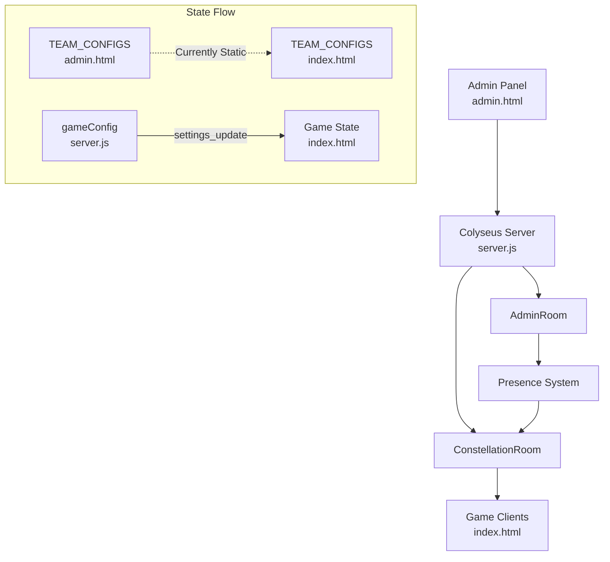
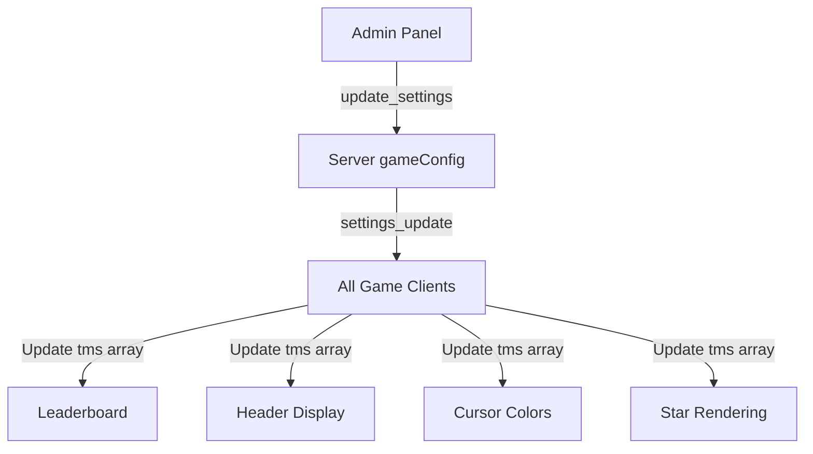

# Design Document

## Overview

This design document addresses the perfection of the existing Star Conquest multiplayer implementation, focusing on bulletproof server-authoritative game logic and dynamic team color synchronization. The goal is to polish the current working Colyseus implementation by identifying and fixing potential bugs, removing redundancies, and ensuring perfect parity between admin panel configuration and game client display.

The system already has a solid foundation with server-side validation, move distribution, and real-time synchronization. This design focuses on incremental improvements to make the system bulletproof.

## Architecture

### Current System Components



### Target Architecture for Team Color Sync



## Components and Interfaces

### Server-Side Components

#### ConstellationRoom (Existing - To Be Enhanced)

**Current State:**
- Stores `gameConfig` with game settings
- Broadcasts `settings_update` when admin changes settings
- Does NOT include team colors in gameConfig

**Enhancement Required:**
- Add `teamColors` array to gameConfig
- Broadcast team color changes via `settings_update`
- Include team colors in initial game state sent to joining clients

**New gameConfig Structure:**
```javascript
{
  name: String,
  gameType: String,
  roundLength: Number,
  rounds: Number,
  countdownLength: Number,
  steals: Number,
  headquarters: Number,
  moves: Number,
  multipliers: { count, distance, hq, destruction },
  aiBots: Array,
  customMap: Object,
  teamColors: [  // NEW
    { color: 0x00FFFF, name: 'cyan', displayName: 'Cyan' },
    { color: 0xFF00FF, name: 'magenta', displayName: 'Magenta' },
    // ... up to 7 teams
  ]
}
```

### Client-Side Components

#### Game Class (index.html - To Be Enhanced)

**Current State:**
- Uses static `TEAM_CONFIGS` array defined at file level
- Copies to `this.tms` on game initialization
- All UI elements reference `this.tms` for colors

**Enhancement Required:**
- Make `TEAM_CONFIGS` mutable or use `this.tms` as the single source of truth
- Update `handleSettingsUpdate()` to process team color changes
- Trigger UI refresh when team colors change

**Key Methods to Modify:**
```javascript
handleSettingsUpdate(data) {
  // Existing: updates multipliers, moves, etc.
  // NEW: Update team colors if provided
  if (data.config.teamColors) {
    this.updateTeamColors(data.config.teamColors);
  }
}

updateTeamColors(teamColors) {
  // Update this.tms array with new colors
  teamColors.forEach((tc, index) => {
    if (this.tms[index]) {
      this.tms[index].c = tc.color;
      this.tms[index].name = tc.name;
      this.tms[index].displayName = tc.displayName;
    }
  });
  // Force full UI refresh
  this.needsFullUIUpdate = true;
  this.updateUI();
  this.updateHeader();
}
```

## Data Models

### Team Color Schema

```javascript
// Server-side (to be added to gameConfig)
teamColors: [
  {
    color: Number,      // Hex color value (e.g., 0x00FFFF)
    name: String,       // Lowercase name (e.g., 'cyan')
    displayName: String // Display name (e.g., 'Cyan')
  }
]

// Client-side (this.tms array)
{
  c: Number,           // Hex color value
  name: String,        // Lowercase name
  displayName: String  // Display name
}
```

### Player State Schema (Existing)

```javascript
{
  id: String,
  name: String,
  studentId: String,   // For color optimizer integration
  team: Number,        // Team index
  movesLeft: Number,
  ready: Boolean,
  connected: Boolean
}
```

## Correctness Properties

*A property is a characteristic or behavior that should hold true across all valid executions of a system—essentially, a formal statement about what the system should do.*

### Property 1: Team Color Consistency
*For any* game session, all connected clients SHALL display identical team colors for the same team index at any given time.
**Validates: Requirements 19.4, 20.6, 21.1**

### Property 2: Server Authority for Colors
*For any* team color configuration change, the server SHALL be the single source of truth, and all clients SHALL update to match within one message cycle.
**Validates: Requirements 19.1, 19.3**

### Property 3: Leaderboard Color Accuracy
*For any* leaderboard render, each team row SHALL use the color value from the synchronized team configuration, not hardcoded values.
**Validates: Requirements 21.1, 21.2, 21.4**

### Property 4: Player Team Color Association
*For any* player with a valid team assignment, their header display, cursor color, and click effects SHALL all use the same team color value.
**Validates: Requirements 20.2, 20.3, 20.4, 20.6**

### Property 5: Move Distribution Correctness
*For any* round start with N players on a team and M total moves, the sum of all player movesLeft values SHALL equal exactly M.
**Validates: Requirements 2.1, 2.4**

### Property 6: HQ Limit Enforcement
*For any* team, the number of HQ placements SHALL never exceed the configured headquarters limit.
**Validates: Requirements 4.1, 4.3**

### Property 7: Steal Limit Enforcement
*For any* team, the number of successful steals SHALL never exceed the configured steals limit.
**Validates: Requirements 5.2, 5.3**

### Property 8: Bot-Human Parity
*For any* move validation, the server SHALL use identical validation logic for both human players and AI bots.
**Validates: Requirements 8.1, 8.7**

## Error Handling

### Team Color Sync Errors

**Missing Team Colors in Config:**
- If `teamColors` is not provided in settings_update, client SHALL retain current colors
- Log warning but do not crash

**Invalid Color Values:**
- Validate color is a valid hex number (0x000000 to 0xFFFFFF)
- Fall back to default color if invalid

**Team Index Out of Bounds:**
- If player's team index exceeds teamColors array length, use modulo to wrap
- Log warning for debugging

### Move Validation Errors

**Current Issues Identified:**
1. `validateClaim()` has commented-out team.movesLeft check - redundant with handler check
2. Player context not passed to validation functions - relies on handler pre-check
3. Late joiners get 0 moves - intentional but should be documented

**Recommended Fixes:**
- Remove redundant checks in validation functions
- Add clear comments explaining validation flow
- Consider giving late joiners proportional moves based on round progress

## Testing Strategy

### Unit Tests

**Team Color Synchronization:**
- Test that settings_update with teamColors updates client tms array
- Test that UI elements use updated colors after sync
- Test fallback behavior when teamColors is missing

**Move Distribution:**
- Test even distribution: 10 moves / 2 players = 5 each
- Test uneven distribution: 10 moves / 3 players = 4, 3, 3
- Test single player: all moves go to one player

**Validation Functions:**
- Test validateClaim rejects owned stars
- Test validateSteal rejects HQ, cluster, blackhole
- Test validateHQ rejects when at limit

### Integration Tests

**End-to-End Color Sync:**
1. Admin changes team color in admin panel
2. Server receives update_settings
3. Server broadcasts settings_update
4. All clients update their tms array
5. Leaderboard re-renders with new colors

**Multiplayer Move Flow:**
1. Game starts with 2 players on same team
2. Moves distributed correctly
3. Player 1 makes move, their movesLeft decrements
4. Player 2's movesLeft unchanged
5. Both clients see same game state

### Property-Based Tests

**Color Consistency Property:**
- Generate random team color configurations
- Simulate broadcast to multiple clients
- Assert all clients have identical tms arrays

**Move Distribution Property:**
- Generate random team sizes (1-10 players)
- Generate random move counts (5-50)
- Assert sum of movesLeft equals total moves

## Implementation Notes

### Files to Modify

1. **server.js**
   - Add `teamColors` to default gameConfig
   - Include teamColors in settings_update broadcasts
   - Include teamColors in game_started message

2. **index.html**
   - Add `updateTeamColors()` method to Game class
   - Modify `handleSettingsUpdate()` to call updateTeamColors
   - Ensure all color references use `this.tms` not static TEAM_CONFIGS

3. **admin.html**
   - Add UI for customizing team colors (optional, can use color.html integration)
   - Send teamColors in update_settings message

### Backward Compatibility

- If server doesn't send teamColors, client uses default TEAM_CONFIGS
- Existing games without teamColors continue to work
- No breaking changes to message format

### Performance Considerations

- Team color updates are infrequent (admin action only)
- Full UI refresh on color change is acceptable
- No need for incremental color updates
